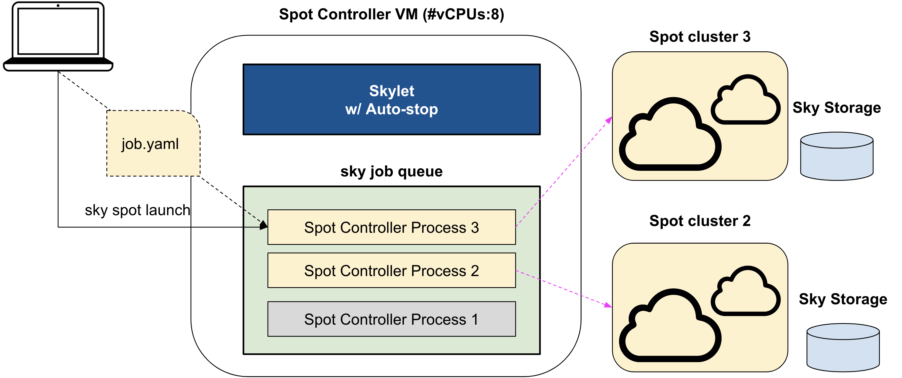

# SkyPilot Managed Spot

This module is used for running user jobs on spot clusters, which automatically recovers the job from preemptions.

## Concepts

- Task: A task (sky.Task) is a unit of work. SkyPilot will launch a spot cluster to run the task, automatically recover the task from preemptions, and terminate the cluster when the task is done.
- Job: A job in the context of SkyPilot managed spot, is equivalent to a SkyPilot DAG (sky.Dag). A job is a collection of tasks that are executed in a specific order based on the dependencies between the tasks. Each controller process will be in charge of the whole lifecycle of a job.

Note that for singleton (1-task) jobs, we will use the term "task" and "job" interchangeably.

A job of n tasks (experimental; we support a pipeline of such tasks only): the job has its own job ID and name, and the tasks have their own task IDs (0, 1, ..., n-1) and names.

## Architecture

